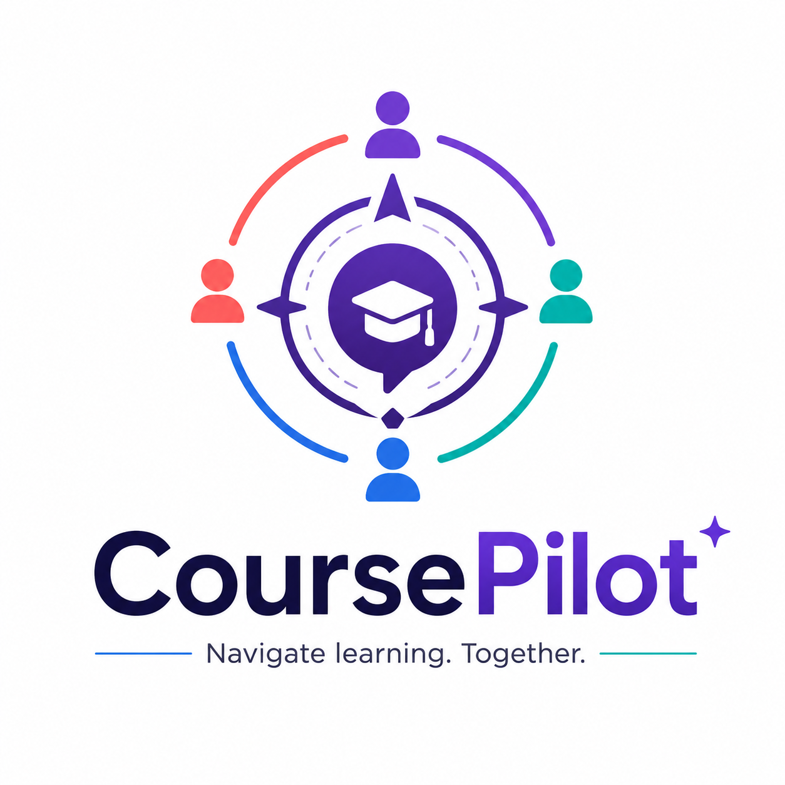

# CoursePilot

<p align="center">
  
</p>

CoursePilot is an AI-powered Slack learning coordinator that helps instructors detect student confusion, coordinate support, and create reusable course resources without leaving the class workspace.

It turns everyday Slack activity into teaching action: study-group suggestions, private quiz checks, instructor summaries, and course FAQ resources.

## Inspiration

Slack is often the center of a course: announcements, questions, study groups, and discussions all happen there. But even though learning conversations happen in Slack, Slack usually stays a passive messaging tool.

CoursePilot started from one question:

> What if Slack was not just where learning happened, but where learning was actively coordinated?

Students often struggle quietly, and repeated questions can get buried in busy class channels. CoursePilot helps instructors see those patterns earlier and respond with targeted support before students fall further behind.

## What it does

- Receives Slack events at `/slack/events`
- Detects repeated question patterns from students
- Alerts the coordinator when a student may need support
- Creates or updates study-group lounges when several students struggle with the same topic
- Imports lecture notes from Slack messages or Google Drive
- Generates low-stakes quiz drafts for instructor approval
- Sends approved quizzes by Slack DM and summarizes student reactions
- Extracts syllabus details with Gemini or Ollama
- Creates a `Course quick fact + FAQ` Slack canvas
- Helps instructors spend less time managing course logistics and more time teaching

Question counts are stored in memory, so they reset when the app restarts.
Course canvas, lecture-note, quiz, and OAuth state are stored under `data/` by default.

## Architecture

See [docs/architecture-diagram.md](docs/architecture-diagram.md) for the Mermaid architecture diagram.

At a high level:

```text
Slack messages, DMs, reactions, canvases
  -> Flask /slack/events
  -> feature modules for study groups, quizzes, and syllabus/FAQ
  -> Slack SDK, Gemini/Ollama, Google Drive MCP, and local JSON storage
```

## Built with

Python, Flask, Slack API, Slack SDK, Gemini, Ollama, Google Drive MCP, Google OAuth, pypdf, pytest, and local JSON storage.

## Quick start

Install dependencies:

```bash
uv sync
```

Create local config:

```bash
cp .env.example .env
```

Fill in the Slack values in `.env`:

- `SLACK_BOT_TOKEN`
- `SLACK_USER_TOKEN`
- `COURSE_CHANNEL_ID`
- `ADMIN_SLACK_ID` or `ADMIN_SLACK_IDS`

Gemini, Ollama, and Google Drive values are optional for startup but needed for AI syllabus extraction, quiz generation, and Drive lecture-note import. See [.env.example](.env.example) for the full list.

Start the app:

```bash
uv run python app.py
```

Expose it to Slack:

```bash
ngrok http 8080
```

Set the Slack Event Subscriptions request URL to:

```text
https://your-ngrok-url.ngrok-free.dev/slack/events
```

Subscribe to:

```text
message.channels
message.im
reaction_added
```

## Slack app setup

Required bot scopes:

- `chat:write`
- `channels:read`
- `channels:history`
- `files:read`
- `canvases:write`
- `users:read`
- `im:write`
- `reactions:read`
- `channels:write.invites`

Required user scopes:

- `search:read`
- `channels:write`
- `channels:write.invites`

If the app listens in private channels, add `groups:history`. Reinstall the Slack app after changing scopes or event subscriptions.

## Google Drive setup

Google Drive import is optional. To enable it, create a Google OAuth client, set `GOOGLE_OAUTH_CLIENT_ID` and `GOOGLE_OAUTH_CLIENT_SECRET`, and add this redirect URI:

```text
http://localhost:8080/google/oauth/callback
```

After the Flask app is running, open:

```text
http://localhost:8080/google/oauth/start
```

## Demo flows

Study-group / question-count flow:

1. Send question messages in a public Slack channel that each end with `?` and include a known topic keyword.
2. Watch the terminal for the question count log.
3. When one student reaches 3 matching questions, check the coordinator Slack DM for the individual help alert.
4. When 3 students reach the threshold for the same topic, confirm the app creates a public `lounge-...` study channel and invites the students.

Quiz flow:

1. From a Slack user whose profile title is `Instructor` or `Teaching Assistant`, DM the bot `lecture note`.
2. Reply `1` to paste notes manually, or `2` to import a recent Google Drive file.
3. For manual notes, use this format:

```text
Topic: Data preprocessing
Note:
Cleaning null values helps students prepare model-ready data.
```

4. Send `quiz`.
5. Pick a topic number.
6. Review the draft, then reply `approve`.
7. Have students answer by reacting with `:one:`, `:two:`, or `:three:`.
8. Send `quiz summary` to receive aggregate understanding.

Syllabus quick fact flow:

1. DM the bot a PDF named `syllabus.pdf`, or upload a PDF with `syllabus` in the DM text, from an Instructor or Teaching Assistant Slack account.
2. Confirm the bot replies with a canvas ID.
3. Confirm `Course quick fact + FAQ` appears in `COURSE_CHANNEL_ID`.
4. Check `data/course_state.json` for the latest active syllabus/canvas state.

Run unit tests:

```bash
uv run python -m pytest
```

## What's next

CoursePilot is moving toward a complete learning coordination layer for online classrooms. Next steps include stronger learning-gap detection, persistent course memory across semesters, richer instructor analytics, deeper Google Drive sync, and support for more learning platforms beyond Slack.
