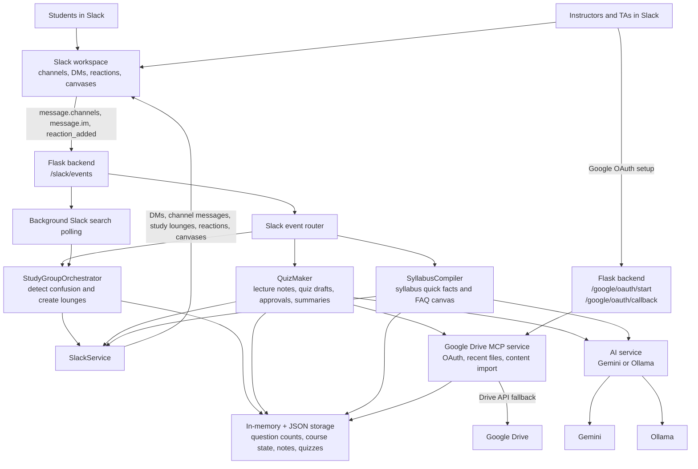

# CoursePilot Architecture

## Data Flow

1. Students and staff interact with the app through Slack messages, DMs, reactions, and canvases.
2. Slack sends events to the Flask `/slack/events` endpoint.
3. The event router sends each event to the right feature module.
4. Study-group logic tracks repeated student confusion and creates Slack study lounges.
5. Quiz logic imports lecture notes, drafts quizzes with AI, sends approved quizzes by DM, and summarizes reactions.
6. Syllabus logic extracts course facts and publishes a Slack canvas.
7. Google Drive MCP brings instructor lecture notes into the quiz workflow.
8. Lightweight storage keeps demo state inspectable during the hackathon.
